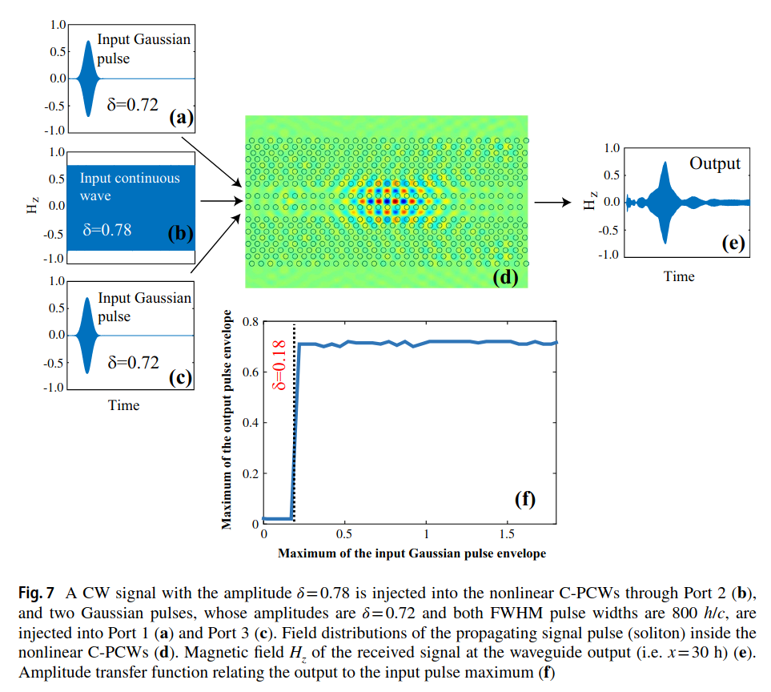
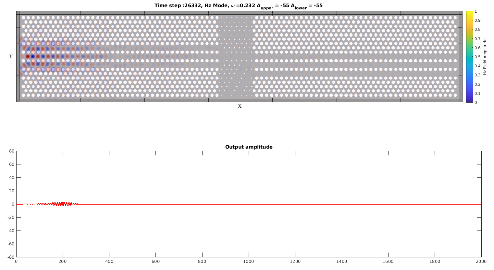

# FDTD Simulation of Optical NAND Gate

This code supports the FDTD simulation results presented in 2019 paper "Digital signal processing in coupled photonic crystal waveguides and its application to an all-optical AND logic gate". The paper is available [online](https://doi.org/10.1007/s11082-019-1833-9).




# Code

Main simulation script is `NAND_Full_Simulation_SC.m`. The file is supposed to be run top-to-bottom, in MatLab. This code simulates the entire structure. The NOT gate (left) and the AND gate (right). Simulation is CPU-only and thus slow. 



Suggested future direction of work, at least on the coding side, should focus on using GPU-acceleration of the simulation. The code is mostly a loop over 2D stencil-kernels. GPUs are well-suited for calculating these.

# Cite as

If you find this code useful in your research, consider citing it as:

```bibtex
@article{jandieri2019,
  author    = {Vakhtang Jandieri and Tornike Onoprishvili and Ramaz Khomeriki and Daniel Erni and Jaromir Pistora},
  title     = {Digital signal processing in coupled photonic crystal waveguides and its application to an all-optical AND logic gate},
  journal   = {Optical and Quantum Electronics},
  volume    = {51},
  number    = {4},
  pages     = {121},
  year      = {2019},
  doi       = {10.1007/s11082-019-1833-9},
  url       = {https://doi.org/10.1007/s11082-019-1833-9},
  issn      = {1572-817X}
}
```